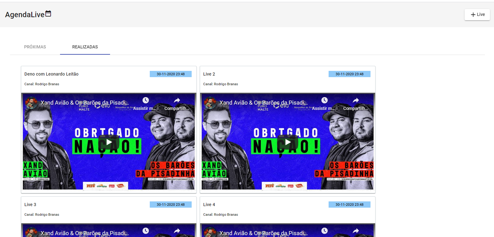
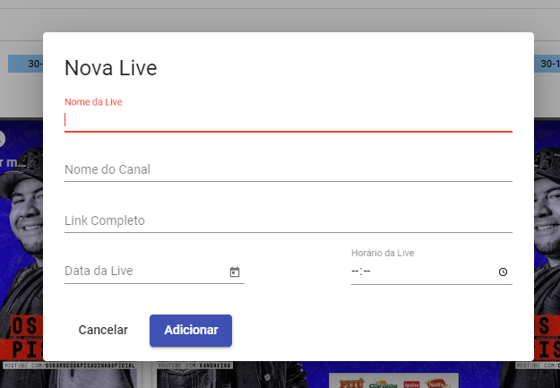

# Agendalive feito com Angular 11

   

   

### Ferramentas e Tecnologias
> VSCode (IDE)  
> Angular 11  
> CSS  
> HTML  
> Typescript  
> Angular Material  
> 
### Link para o backend 
> https://github.com/MichelliBrito/agendalive  
### Créditos 
> Michelli Brito  